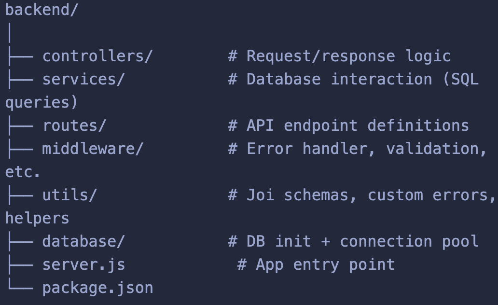

# 🗂️ Task Manager Backend (Node.js + Express + PostgreSQL)

A clean, modular, and production‑ready backend API for managing tasks.  
Built with **Node.js**, **Express**, **PostgreSQL**, and structured using
professional backend patterns such as controllers, services, middleware, and
validation.

This project is part of a growing collection of backend applications inside the
`node-project` folder, where I explore best practices, architecture patterns,
and deployment workflows.

---

# 🛠️ Tech Stack

- Node.js
- Express
- PostgreSQL (pg)
- Joi (validation)
- Morgan (logging)

---

## 🚀 Features

### ✔ RESTful API for Task Management

- Create a task
- Retrieve all tasks
- Retrieve a single task
- Update a task
- Delete a task

### ✔ Clean Architecture

- **Routes** → define API endpoints
- **Controllers** → handle request/response logic
- **Services** → interact with PostgreSQL using `pg`
- **Database layer** → raw SQL queries + initialization script

### ✔ Robust Error Handling

- Global error handler middleware
- Custom `NotFoundError` class
- Consistent JSON error responses

### ✔ Input Validation

- **Joi** schema validation for request body
- Param validation for `:id`
- Reusable validation middleware

### ✔ Logging

- **Morgan** for HTTP request logging

---

## 🏗️ Project Structure

## 

## 🗄️ Database Schema

The `tasks` table is created automatically on startup:

```sql
CREATE TABLE IF NOT EXISTS tasks (
  id SERIAL PRIMARY KEY,
  title VARCHAR(255) NOT NULL,
  active BOOLEAN DEFAULT TRUE,
  description TEXT
);
```

## 📡 API Endpoints

- TODO: Add API Documentation using Swagger

## Upcoming Features (In Progress)

### 🔧 Testing

- Jest + Supertest integration
- Unit tests for services
- Integration tests for API endpoints

### 🔄 CI/CD

- GitHub Actions workflow
- Automated testing on push
- Build pipeline for deployment

### 🐳 Docker

- Dockerfile for backend
- docker-compose for backend + PostgreSQL

### ☁️ Deployment

- Deploy to Render
- Environment variable configuration
- Production logging
